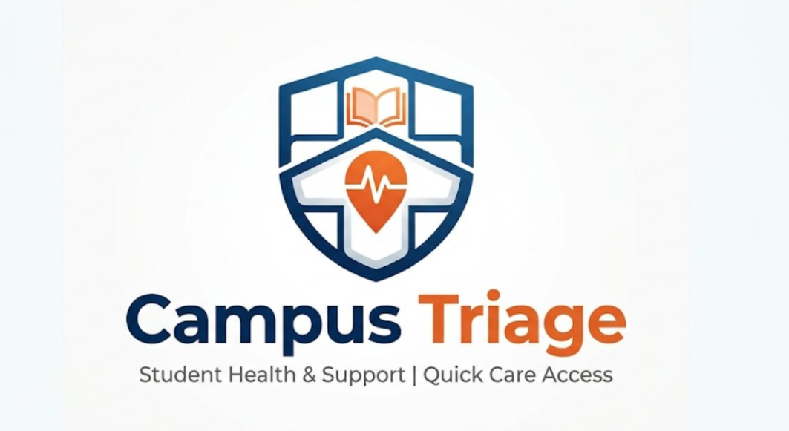
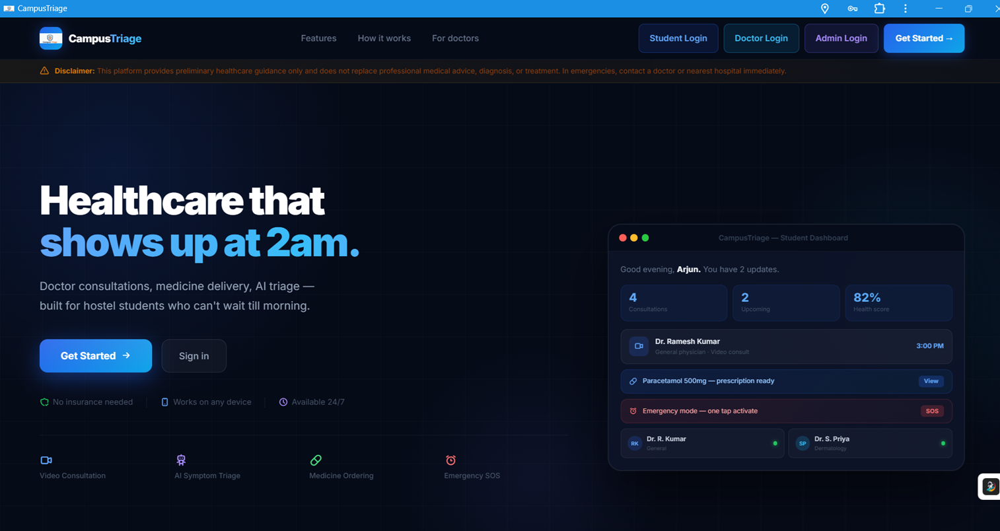
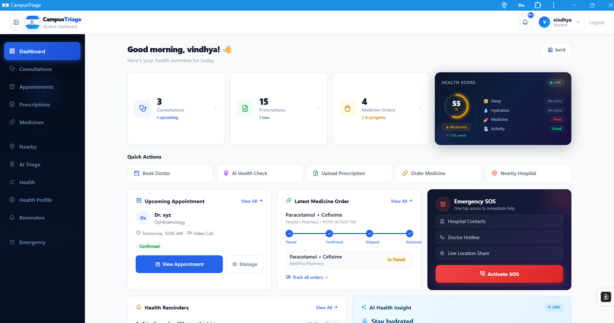
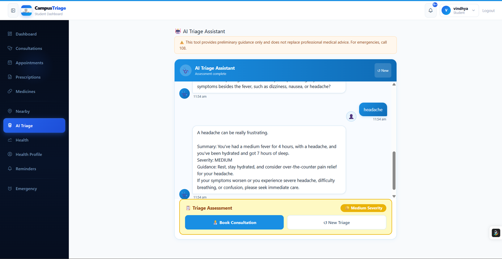
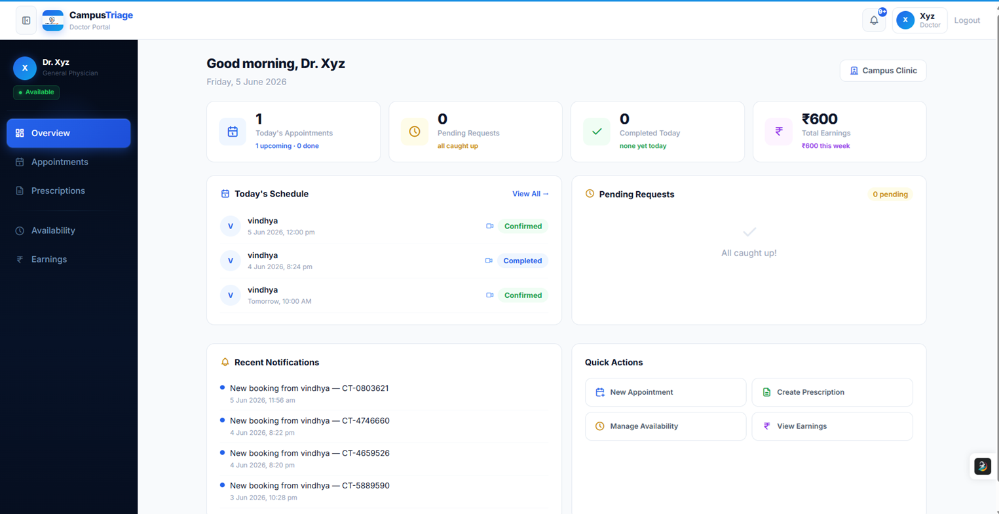
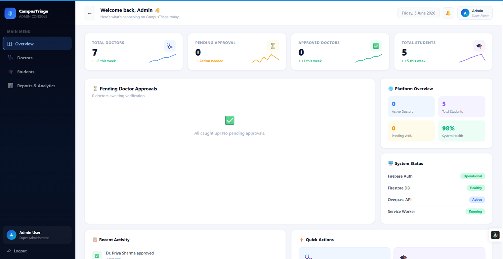
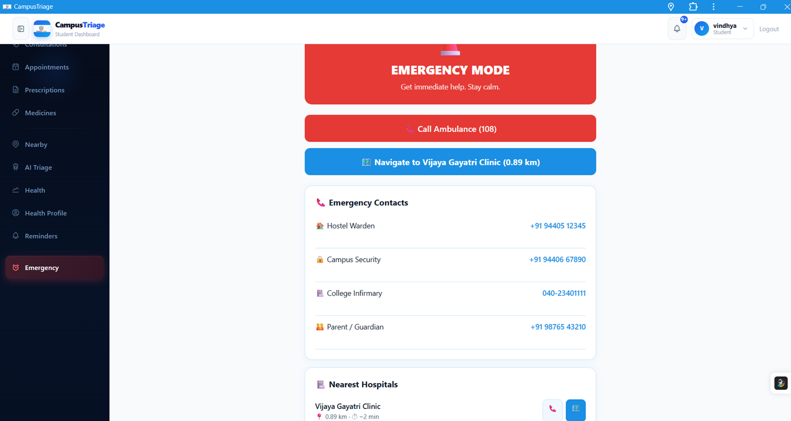

<div align="center">



# CampusTriage

### Healthcare Support Platform for Hostel Students

[](https://campus-triage-23tk.vercel.app)
[](https://campus-triage-23tk.vercel.app)
[](https://reactjs.org)
[](https://firebase.google.com)
[](https://groq.com)

**Doctor consultations · AI triage · Medicine delivery · Emergency SOS**

[Live Demo](https://campus-triage-23tk.vercel.app) · [Report Bug](https://github.com/Vindhya2006/campus-triage/issues) · [Request Feature](https://github.com/Vindhya2006/campus-triage/issues)

</div>

---

## 🩺 The Problem

Hostel students face a unique healthcare gap that no existing product solves:

- 🌙 **Illness doesn't follow office hours** — sickness at 2am, with no one to call
- 🏥 **Hostels are far from hospitals** — no transport, no nearby pharmacy at midnight  
- ❓ **Students don't know when it's serious** — no medical knowledge to judge severity

**CampusTriage solves all three.**

---

## 🚀 Live Demo

> **Try it now:** [https://campus-triage-23tk.vercel.app](https://campus-triage-23tk.vercel.app)

| Role | Email | Password |
|------|-------|----------|
| Student | Create your own account | — |
| Doctor | Register via Doctor Portal | — |
| Admin | Set via Firebase Console | — |

---

## ✨ Key Features

### 👤 Multi-Role Authentication
- Separate portals for **Students**, **Doctors**, and **Admins**
- Firebase Auth with role-based access control
- Doctor accounts require admin approval before going live

### 🩺 Doctor Consultation Flow
- Browse verified doctors by specialization, rating, and availability
- Real-time appointment booking with symptom input
- Video consultations via **Jitsi Meet** (WebRTC)
- Digital prescriptions saved to Firestore, visible to students instantly

### 🤖 AI Symptom Triage
- Conversational AI powered by **Groq LLaMA 3.3-70B**
- Asks targeted follow-up questions one at a time
- Returns **Low / Medium / High** severity assessment
- Actionable guidance — rest, hydration, or see a doctor now

### 💊 Medicine Ordering
- GPS-powered nearby pharmacy detection via **Overpass API**
- Order directly from prescriptions with quantity control
- Real-time order tracking: Placed → Processing → Out for Delivery → Delivered

### 📍 Nearby Services
- Live GPS lookup of hospitals and pharmacies within 10km
- Real distance, ETA, phone numbers, and one-tap directions
- Multiple Overpass API mirrors for reliability

### 🚨 Emergency SOS
- One-tap ambulance call (108)
- Real GPS-based hospital navigation via OpenStreetMap
- Emergency contacts management (warden, security, infirmary)

### 📊 Health Analytics
- Dynamic health score (0–100) calculated from real Firestore data
- Tracks medicine adherence, appointments, prescriptions, and orders
- Sleep, water, and meal logging with weekly charts
- AI-powered personalized health insights

### 🔔 Smart Reminders
- Auto-creates medicine reminders from prescriptions
- Pre-consultation alerts at 5, 10, and 30 minutes before
- Browser push notifications (PWA)

### 🛡️ Admin Panel
- Approve or reject doctor registrations
- View all students and doctors
- Platform analytics: specialization breakdown, college distribution
- Real-time stats from Firestore

---

## 🛠 Tech Stack

| Layer | Technology |
|-------|-----------|
| **Frontend** | React 18, Vite 5 |
| **Styling** | Inline styles + Tabler Icons |
| **Auth & Database** | Firebase Auth + Firestore (real-time) |
| **AI Triage** | Groq API — LLaMA 3.3-70B-Versatile |
| **Video Calls** | Jitsi Meet External API |
| **GPS & Maps** | Overpass API + OpenStreetMap |
| **PWA** | vite-plugin-pwa + Workbox |
| **Deployment** | Vercel |

---

## 🏗 Architecture

```
campus-triage/
├── public/
│   └── icons/              # PWA icons (all sizes + maskable)
├── src/
│   ├── App.jsx             # Full application (~7000 lines)
│   ├── firebase.js         # Firebase initialization
│   ├── main.jsx            # React entry + SW registration
│   ├── hooks/
│   │   └── useAuth.js      # Firebase auth state hook
│   └── services/
│       └── db.js           # All Firestore operations
├── vite.config.js          # Vite + PWA + proxy config
└── vercel.json             # Vercel rewrites for Groq API proxy
```

### Data Flow
```
Student books → Firestore (appointments) → Doctor onSnapshot fires
Doctor sends Rx → Firestore update → Student onSnapshot fires
Admin approves → status:"approved" → Visible in student doctor list
```

---

## ⚙️ Local Setup

### Prerequisites
- Node.js 18+
- Firebase project with Auth + Firestore enabled
- Groq API key (free tier at console.groq.com)

### Installation

```bash
# 1. Clone the repository
git clone https://github.com/Vindhya2006/campus-triage.git
cd campus-triage

# 2. Install dependencies
npm install

# 3. Create environment file
cp .env.example .env
```

### Environment Variables

Create a `.env` file in the root:

```env
VITE_FIREBASE_API_KEY=your_firebase_api_key
VITE_FIREBASE_AUTH_DOMAIN=your_project.firebaseapp.com
VITE_FIREBASE_PROJECT_ID=your_project_id
VITE_FIREBASE_STORAGE_BUCKET=your_project.appspot.com
VITE_FIREBASE_MESSAGING_SENDER_ID=your_sender_id
VITE_FIREBASE_APP_ID=your_app_id
VITE_GROQ_API_KEY=your_groq_api_key
```

```bash
# 4. Start development server
npm run dev
# Opens at http://localhost:3000
```

---

## 📱 PWA Installation

CampusTriage is a fully installable Progressive Web App.

**Android (Chrome):**
Tap ⋮ menu → Add to Home Screen

**iOS (Safari):**
Tap Share → Add to Home Screen

**Desktop (Chrome):**
Click the install icon (⊕) in the address bar

---

## 🔐 Firebase Setup

1. Create a Firebase project at [console.firebase.google.com](https://console.firebase.google.com)
2. Enable **Authentication** (Email/Password)
3. Enable **Firestore Database**
4. To create an admin account:
   - Sign up normally via the app
   - Go to Firestore → `users/{uid}` → set `role: "admin"`

---

## 🚀 Deployment

```bash
# Build for production
npm run build

# Deploy to Vercel (auto-deploys on git push)
git push origin main
```

Add all `VITE_*` environment variables in Vercel → Settings → Environment Variables.

---

## 📸 Screenshots

> *(Add screenshots of your app here)*

| Landing Page | Student Dashboard | AI Triage |
|---|---|---|
|  |  |  |

| Doctor Portal | Admin Panel | Emergency SOS |
|---|---|---|
|  |  |  |

---

## ⚠️ Disclaimer

This platform provides **preliminary healthcare guidance only** and does not replace professional medical advice, diagnosis, or treatment. In emergencies, contact a doctor or the nearest hospital immediately. Call **108** for ambulance services in India.

---

## 👩‍💻 Built By

**Vindhya** — 3rd Year CS/Engineering Student  
Targeting AI/ML Engineering | Full-Stack Developer

[](https://github.com/Vindhya2006)
[](https://linkedin.com/in/vindhyachoudary)

---

<div align="center">

**Built with ❤️ for 10M+ hostel students across India**

⭐ Star this repo if you find it useful!

</div>